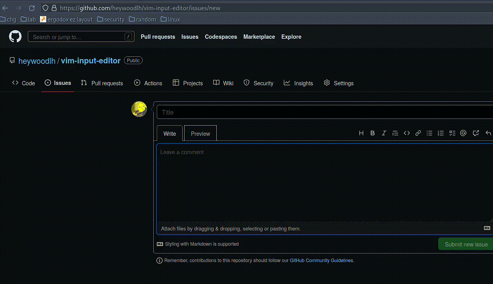

## vim-input-editor

Open Vim in a terminal emulator to either inject keystrokes on your currently open window or copy to clipboard. Also supports editing the clipboard's current contents.

Basically just a Python alternative to [vime](https://github.com/pop-os/shell).

Supported only on hosts running X11 with `xdotool` and `xclip` installed.



## Usage: 

```
./vim-ime.py --cmd "xterm -e vim" --outfile "/tmp/vim-ime.txt"
```

### Help:

```
usage: vim-ime.py [-h] -o OUTFILE -c CMD [-e] [-p]

options:
  -h, --help            show this help message and exit
  -o OUTFILE, --outfile OUTFILE
  -c CMD, --cmd CMD
  -e, --clipboard-edit  edit clipboard contents
  -p, --clipboard-copy  copy to clipboard
```
